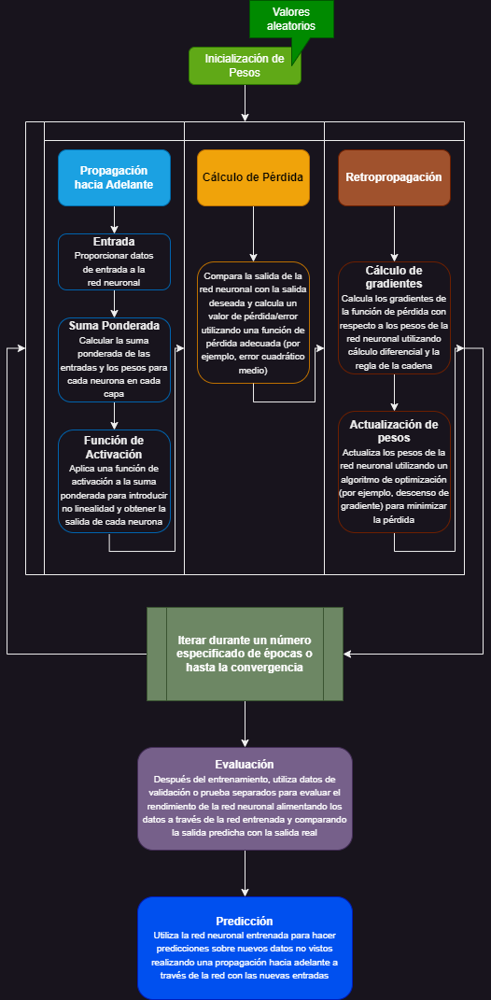

# Definición de una red neuronal

Una red neuronal es un modelo computacional inspirado por la estructura y funcionamiento del cerebro humano. Consiste de unidades de procesamiento interconectadas llamadas neuronas, las cuales se organizan en capas. La información fluye a través de esas capas, con cada neurona realizando una simple operación matemática con sus entradas y pasando el resultado a la siguiente capa. Las conexiones entre las neuronas son representadas por pesos (weights), los cuales determinan la fuerza y significado de las conexiones.

Las redes neuronales se usan típicamente para tareas como reconocimiento de patrones, clasificación, regresión y decisiones basadas en las entradas de información. Las redes neuronales aprenden por medio de ejemplos ajustando los pesos entre las neuronas por un proceso llamado entrenamiento, el cual involucra alimentar la red con datos de entrada y comparando sus salidas con la salida deseada. La red después actualiza sus pesos para minimizar las diferencias entre las salidas predecidas y las salidas deseadas, usando algoritmos como propagación hacia atrás (backpropagation).

# Ejemplos de redes neuronales

- ### Clasificación de imágenes
Las redes neuronales pueden ser entrenadas para clasificar imágenes, como reconocimiento de manuscritos, identificar objetos en fotos o imágenes o distinguir animales de entre varias imágenes parecidas.

- ### Procesamiento de lenguaje natural
Las redes neuronales se utilizan en tareas relacionadas al entendimiento y generación de lenguaje natural. Por ejemplo, en análisis de sentimiento, traducción automática, chatbots, resumir textos y reconocimiento del habla.

- ### Vehículos autónomos.
Las redes neuronales juegan un gran papel en permitir la navegación automática en automóviles. Procesan la información de los sensores, como imágenes de las cámaras o lecturas de radares y LiDAR (detección y medición de la luz) para percibir el ambiente, detectar objetos y hacer decisiones para navegar, acelerar y frenar

- ### Detección de fraude
Las redes neuronales se utilizan en detección de fraudes en varios dominios, como transacciones con tarjetas de crédito, reclamo de seguros, o banca en línea. Aprenden a identificar patrones y anomalías en la información que indica una actividad fraudulenta potencial.

- ### Recomendar sistemas.
Muchas plataformas en línea utilizan redes neuronales para construir sistemas de recomendación personal. Esos sistemas analizan el comportamiento y preferencias del usuario para sugerir productos relevantes, películas, música, o artículos.

# Esquema general de las matemáticas involucradas en redes neuronales

# NLP (Natural Language Processing)

El Procesamiento de Lenguaje Natural (NLP) es el área que más me interesaría para poder explorar para el trabajo con redes neuronales. En lo particular me llama la atención qué tan variadas pueden ser las aplicaciones de ésta área y sobre todo el gran valor que aportan a los problemas cotidianos de nuestra sociedad. 

El desarrollo de chatbots me parecería un buen punto de partida para poder comprender los conceptos, técnicas y procesos relacionados al NLP.
